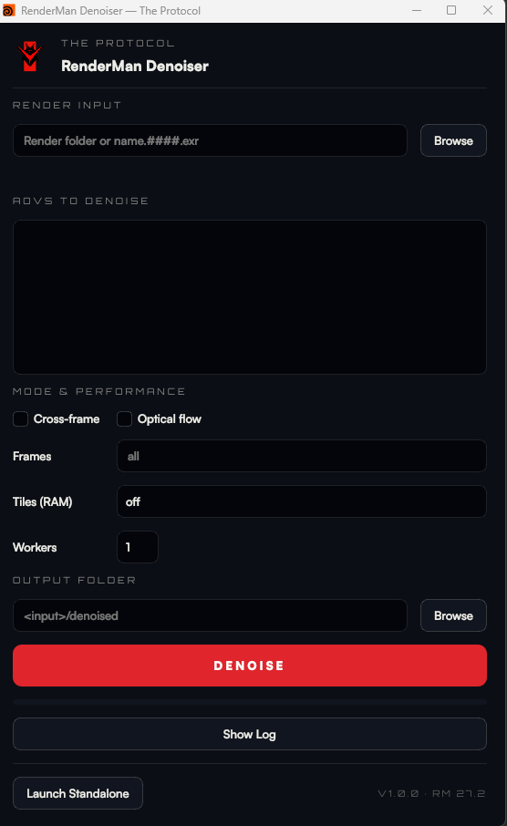

# rman_denoiser

A Python wrapper around RenderMan 27.2's `denoise_batch`. It discovers the AOVs in a render
(from a `denoise_batch -dr` dry-run config), lets you **select exactly which AOVs to denoise**,
and runs single- or cross-frame denoising with optical flow and tiled (low-RAM) processing.
The win over the stock `denoise` GUI: it only processes the AOVs you pick (pruned config) — faster
and lighter — instead of denoising everything.

- **Runtime:** the GUI runs on Houdini 21's bundled Python (PySide2); the CLI/core run on any Python 3.11+.
- **RenderMan:** located via `$RMANTREE` (falls back to the default install path, or `--rman` override).

## GUI

Launch `RMDenoise.bat` from the repo root (runs `gui.py` via Houdini's `hython`). Pick a render, tick the
AOVs to denoise, choose single/cross-frame + flow + tile size + worker count, hit Denoise.

Inside Houdini, the same window is available as a shelf tool via the bundled `ALTProtocol` package —
see [Install the Houdini shelf tool](#install-the-houdini-shelf-tool-altprotocol-package) below.

## Install the Houdini shelf tool (ALTProtocol package)

The denoiser ships as a Houdini **package** so it appears as a shelf tool inside Houdini. A package is
just a tiny pointer file that tells Houdini where the tool lives — you never copy code into Houdini's
install folder, and updating the repo updates the tool. **You don't write that file yourself — an
installer does it for you.**

1. **Put the repo somewhere permanent.** Any location works; it just needs to contain `ALTProtocol/`,
   `rman_denoiser/`, and the `.bat` files.

2. **Double-click `install_houdini_package.bat`** (in the repo root). It writes the pointer file into
   your Houdini packages folder, automatically filled in with this repo's location — no editing, no path
   typing. (It targets Houdini 21.0 by default; on another version, open the `.bat` and change the
   `HVER=houdini21.0` line.)

3. **Launch (or restart) Houdini and show the shelf.** New shelf tabs aren't displayed automatically:
   click the small **▾ / +** button at the left end of the shelf-tab bar, open the **Shelves** list, and
   enable **ALT Protocol**. The tab appears with the **RMDenoise** tool — click it to open the denoiser.

> **Prefer to do it by hand?** Create `%USERPROFILE%\Documents\houdini21.0\packages\ALTProtocol.json`
> containing `{ "path": "<your-repo>/ALTProtocol" }` (forward slashes). That one line is all the installer
> writes.

> **Don't want to touch Houdini at all?** Just double-click `RMDenoise.bat` in the repo root — it opens
> the exact same window standalone.

## Roadmap

- **Deadline integration — on the way.** A Deadline submitter that farms one frame per node is the next
  milestone. The CLI is already farm-friendly (deterministic args, streaming `--progress`, per-frame
  `--jobs`), so the submitter wraps it directly.
- **Group AOVs by category** in the UI (beauty / diffuse / specular / light-groups) — currently a flat list.
- **Houdini panel**: the shelf tool ships today via the `ALTProtocol` package; a dockable Python panel that
  reads the current ROP output is the next step.

## Credits

Built by Thomas Spony. Developed with assistance from Claude (Anthropic).
